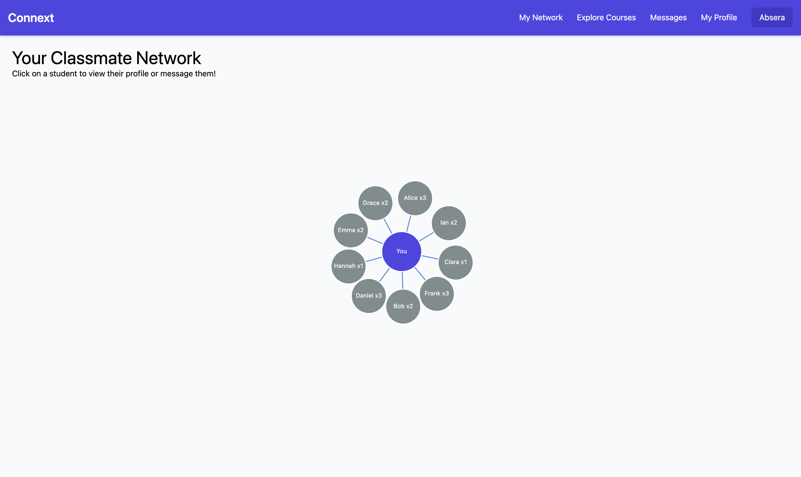

# Connext

## Overview

College is full of hidden connections--classmates, potential study partners, and collaborators you may not even know exist. Connext reveals these links, helping students visualize and expand their academic network with purpose.

With Connext, students register, add their courses, and instantly see a map of direct and indirect connections in their classes. Students who are taking more classes together will have bold or bright connections in the graph, highlighting their stronger ties. By showcasing these unseen relationships in an interactive graph, Connext empowers students to find study buddies, team up for projects, and build a meaningful community. It’s a unique tool for unlocking the full potential of college connections and fostering collaboration across campus.


## Data Model

The app stores information for Users, Courses, Enrollments, Messages, and Activity Feeds.

- Users have profiles with names, emails, passwords, class year, karma score, and a list of their enrolled courses.
- Courses are created by users and contain a course number, name, semester, and a link to the user who created it.
- Enrollments connect users to courses, with each entry ensuring users are enrolled in a unique course per semester.
- Messages allow users to chat, with each message showing the sender, receiver, content, and timestamp.
- Activity Feeds log key events, like new courses or classmates joining, so users stay updated.


An Example User:

```javascript
{
  netid: "jdoe123",
  firstName: "John",
  lastName: "Doe",
  email: "jdoe123@nyu.edu",
  password: // a hashed password,
  classYear: 2025,
  karma: 10,
  courses: [ // an array of references to Course documents
    ObjectId("609c1f1b34edbc3d9e2a842f"),
    ObjectId("609c1f1b34edbc3d9e2a8430")
  ]
}
```

An Example Course:

```javascript
{
  creatorId: ObjectId("609c1e7734edbc3d9e2a8410"), // reference to the User who created it
  courseNumber: "CS101",
  semester: "Fall 2024",
  courseName: "Introduction to Computer Science"
}
```

An Example Enrollment:

```javascript
{
  courseNumber: "CS101",
  semester: "Fall 2024",
  userId: ObjectId("609c1e7734edbc3d9e2a8410") // reference to the User who enrolled
}
```

An Example Message:

```javascript
{
  senderId: ObjectId("609c1e7734edbc3d9e2a8410"), // User ID of the sender
  receiverId: ObjectId("609c1f1b34edbc3d9e2a8411"), // User ID of the receiver
  value: "Hey! Are you joining the study group?",
  timeSent: ISODate("2024-10-20T15:43:12Z")
}
```

An Example Activity Feed:

```javascript
{
  title: "New user joined your class CS101",
  timeStamp: ISODate("2024-10-20T15:43:12Z"),
  type: "new user joined your class"
}
```

## [Link to Commented First Draft Schema](db.mjs) 


## Wireframes

/home - page for viewing your network



/add-course - page for adding a new course


/messages - page for chats with other users


/register - page to register


## Site map


## User Stories or Use Cases

1. As a non-registered user, I can register a new account with my net ID and class year so that I can access the app and start connecting with classmates.
2. As a registered user, I can log in to the app using my net ID and password to access my account and view my connections.
3. As a user, I can create a new course by entering the course number, name, and semester to make it available for other students to join.
4. As a user, I can join existing courses by selecting the course number and semester so that I can see classmates in the same courses.
5. As a user, I can view my class connection network, showing classmates in each course and any shared courses with connections.
6. As a user, I can view other users’ profiles to see their course enrollments, which can help me find common classes and potential study partners.
7. As a user, I can send a message to classmates to coordinate study groups or ask questions about class materials.
8. As a user, I can increase or decrease the karma of a classmate to acknowledge their helpfulness or contributions to class collaboration.
9. As a user, I can see an activity feed notifying me of new classmates joining my courses or newly created courses, helping me stay updated on class-related events.
10. As a user, I can log out to ensure my account information remains secure.

## Research Topics

* (3 points) Automated functional testing
* (3 points) Configuration management
* (3 points) Use build tools
* (2 points) Use a CSS framework
    * i'll use tailwind css
* (2 points) Use a client-side JavaScript library
    * i'll use d3 to display graphs and networks

## [Link to Initial Main Project File](app.mjs) 

## Annotations / References Used
